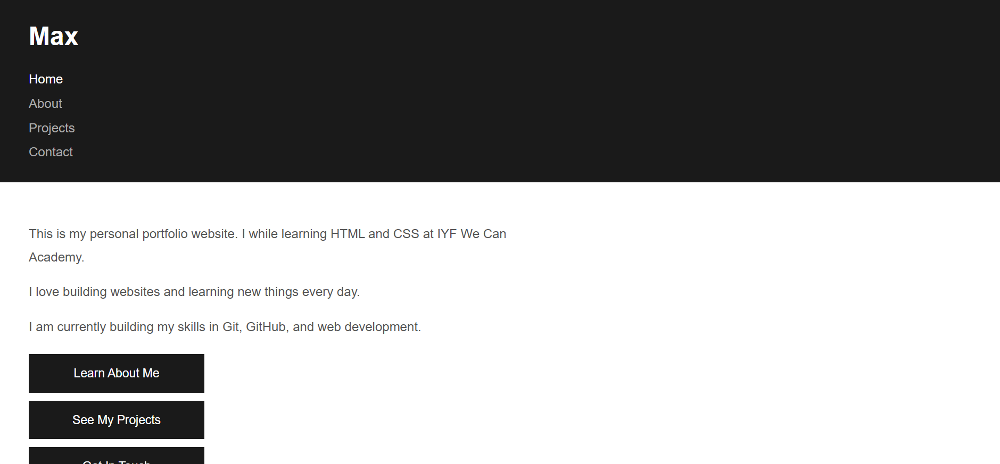

# Week 01: Web Foundations

## Author
- **Name:** Max
- **GitHub:** [@maxboffin254](https://github.com/maxboffin254)
- **Date:** June 24, 2026

## Project Description
I developed a multi-page personal portfolio to practice HTML structure, semantic markup, and basic styling. The site introduces who I am, showcases projects I have worked on, and provides ways to contact me through Gmail, phone, or WhatsApp.

## Technologies Used
- HTML5
- CSS3
- JavaScript
- VS Code
- Git
- GitHub

## Features
- Home page with a hero section, brief introduction, and links to every other section
- About page with background story, skills list, and education timeline
- Projects page with three project cards, each including a title, description, and image
- Contact page with a validated form, social links, and location/timezone details

## How to Run
1. Clone this repository
2. Open `index.html` in your browser

## Lessons Learned
Building this portfolio taught me how to organize a multi-page site with consistent navigation, apply CSS for layout and readability, and add images without breaking their display or accessibility properties.

## Challenges Faced
1. **CSS styling approach** — I had to choose between external, internal, and inline styles. I settled on an external stylesheet to keep my HTML cleaner and easier to maintain.
2. **Git sync conflicts** — I edited files on GitHub without pulling first, which blocked my push. I resolved it by pulling remote changes, fixing merge conflicts, and pushing again in the correct order.

## Screenshot

## Live Demo
[View Live Demo](https://maxboffin254.github.io/iyf-s11-week-01-maxboffin254/index.html)

## Technical Article
[Add your article URL here once published]
