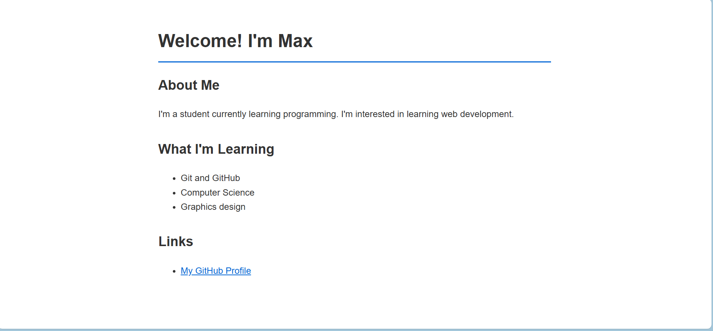

# Accessibility Audit Report — index.html

## Issues Found & How They Were Fixed

### 1. Images — Missing `alt` Text

**Issue:** Screen readers cannot describe images that lack an `alt` attribute, which excludes visually impaired users from understanding visual content.

**Fix:** Descriptive `alt` text was added to every image on the page.

```html
<!-- Before -->


<!-- After -->

```

---

### 2. Heading Hierarchy — Skipping Levels

**Issue:** Skipping from `<h1>` to `<h3>` breaks the document outline and confuses assistive technology about page structure.

**Fix:** Headings now follow a sequential order from `<h1>` through `<h2>` and `<h3>` without skipping levels.

```html
<!-- Before -->
<h1>Max</h1>
<h3>My Hobbies</h3>

<!-- After -->
<h1>Max</h1>
<h2>My Hobbies</h2>
```

---

### 3. Links — Non-Descriptive Link Text

**Issue:** Vague link text such as "click here" does not tell screen reader users where a link will take them.

**Fix:** Link text was rewritten to describe the destination clearly.

```html
<!-- Before -->
<a href="https://www.freecodecamp.org/">Click here</a>

<!-- After -->
<a href="https://www.freecodecamp.org/">Browse freeCodeCamp — my preferred coding learning resource</a>
```

---

### 4. Image link referencing
**Issue:** Images were not loading on the website beause of link referencing issues.

**Fix:** Created an images folder and made sure that the image src links directed to images in Image folder.

```html
<!-- Before -->


<!-- After -->
 
 ```

---

### 5. Form Labels — Inputs Without Associated Labels

**Issue:** Form inputs with no linked `<label>` leave screen reader users unsure of what each field is for.

**Fix:** Every input was paired with a `<label>` using a matching `for` and `id` attribute.

```html
<!-- Before -->
<input type="email" placeholder="Your email">

<!-- After -->
<label for="email">Email Address</label>
<input type="email" id="email" placeholder="e.g. max@email.com" required>
```

---

## Final Lighthouse Accessibility Score

**Score: 100/100**

---
